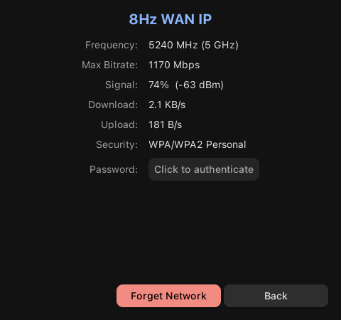
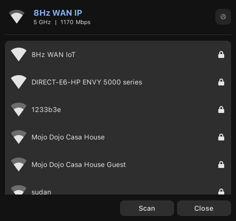

# tnywfi

A simple GTK 3 Wi-Fi applet for NetworkManager written in Python.
It provides a small window for viewing your current connection, scanning nearby networks, and connecting to them without leaving the desktop environment.

This project was vibe coded in an hour, so expect a lightweight and experimental experience.

## Features

- Shows the current Wi-Fi status and signal strength
- Lists available wireless networks in a compact GTK window
- Connects to open and password-protected networks
- Reuses existing saved connections for quick reconnection
- Lets you forget saved networks
- Shows connection details such as frequency, bitrate, RSSI, upload/download traffic, and security type
- Can reveal saved passwords after authentication through Polkit
- Includes a disconnect action for the active connection

## Requirements

### Arch Linux

Install the following packages:

```bash
sudo pacman -S python python-gobject gtk3 networkmanager polkit
```

## Running

```bash
python3 tnywfi.py
```

The app relies on NetworkManager being available and running on your system.

## Screenshots




